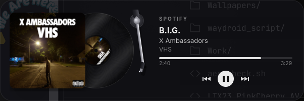
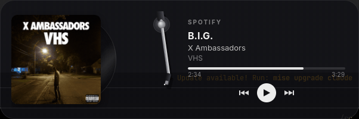
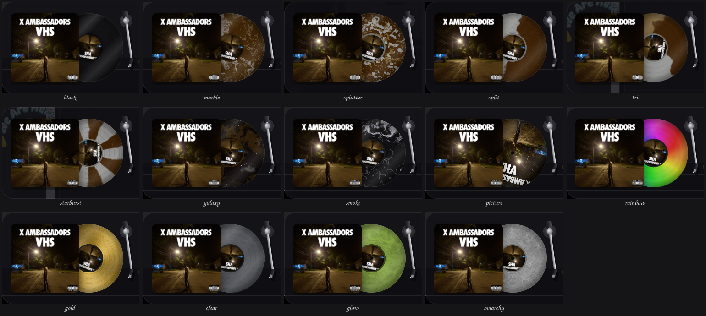
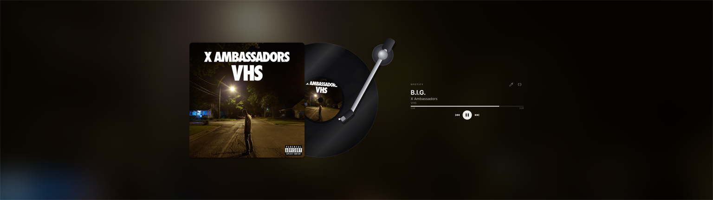

# Vinyl

A spinning-record "now playing" widget for [Omarchy](https://omarchy.org) and
other Hyprland desktops. It reads whatever is playing over
[MPRIS](https://specifications.freedesktop.org/mpris-spec/latest/), so any
music player that speaks it works, with no accounts and no API keys.



Press play and the record slides out of its sleeve, spins up to 33⅓, and the
tone arm drops onto the groove. The stylus tracks inward as the song plays.
Pause and the arm lifts, the platter coasts down, and the record slides home.



- Click the record or the arm to play/pause, the sleeve to raise the player.
- Drag the card anywhere to move it. The position is remembered.
- Hover the card for two corner buttons: one steps through fourteen pressings
  (right-click steps back), the other opens the full-screen view.
- Follows whichever player is playing and hands off between players.
- Lives on every workspace, or only the ones you choose, on the monitor you choose.
- About 3% CPU while spinning, on a 144 Hz display.

## Pressings



| Preset | Look |
| --- | --- |
| `black` | The classic pressing. |
| `marble` | Domain-warped swirl in the album art's colours, with white veins. |
| `splatter` | Base colour with paint-splatter blobs of the other two art colours. |
| `split` | Two art colours, half and half, with a wavy seam. |
| `tri` | Three art colours in wedges. |
| `starburst` | Fourteen alternating spokes of two art colours. |
| `galaxy` | Deep space, nebulae in the art's colours, and stars. |
| `smoke` | Black with white smoke wisps. |
| `picture` | Picture disc: the art edge to edge, no label. |
| `rainbow` | A hue sweep around the disc. |
| `gold` | Brushed metallic gold. |
| `clear` | Translucent pressing. |
| `glow` | Glow-in-the-dark green. |
| `omarchy` | Marbled from the current Omarchy theme: accent, the most saturated theme colours, foreground. Re-presses live when you switch themes. |

The art-based pressings pick the album's dominant colour first, then the
colours most distinct from it, so two-tone patterns keep their contrast. Any
pattern (`solid`, `marble`, `splatter`, `split`, `tri`, `starburst`, `galaxy`,
`smoke`, `picture`, `rainbow`, `gold`, `clear`) combines with any palette
(`art`, `theme`, `black`, or a comma-separated list of CSS colours) as
`pattern:palette`:

```sh
vinyl --vinyl starburst:theme
vinyl --vinyl tri:crimson,gold,black
vinyl --vinyl splatter:#1e90ff,white
vinyl --vinyl teal                  # a plain CSS colour is a solid pressing
```

The pressing picked with the button is saved to `~/.config/vinyl/style` and
used on the next start unless `--vinyl` is given.

## Full screen



The corner button, `--fullscreen`, or a right-click on the bar widget fills the
monitor with a large record over a blurred, darkened version of the album art.
Escape or a click on the background brings the widget back.

## Install

### As an Omarchy plugin

```sh
omarchy plugin add https://github.com/Knowsys42/omarchy-vinyl.git --enable
```

That puts a small record in the bar that turns while music plays. Left-click
opens or closes the desktop widget, right-click opens the full-screen view,
middle-click steps to the next pressing. Shift+click brings the widget to the
monitor and workspace you're on; Ctrl+click shows it everywhere again. The first click builds the widget
from source, which takes about a minute and needs `rust`, `gtk4`, and
`gtk4-layer-shell` (`omarchy pkg add rust gtk4 gtk4-layer-shell`). Once
`vinyl` is on your `PATH` the plugin uses that instead.

Bar-widget settings, in the plugin's entry in `~/.config/omarchy/shell.json`:

| Key | Default | Meaning |
| --- | --- | --- |
| `args` | `""` | Extra flags for a fresh start, e.g. `"--vinyl marble --ignore brave"`. |
| `showTitle` | `false` | Show the playing track's title next to the record. |

### From source

```sh
sudo pacman -S --needed gtk4 gtk4-layer-shell rust
git clone https://github.com/Knowsys42/omarchy-vinyl.git
cd omarchy-vinyl
cargo build --release
install -Dm755 target/release/vinyl ~/.local/bin/vinyl
```

To start it with your session, add to `~/.config/hypr/autostart.lua`:

```lua
o.launch_on_start("vinyl --ignore brave")
```

Optional, so Omarchy blurs the card like its own panels:

```
layerrule = blur, vinyl
layerrule = ignorezero, vinyl
```

## Run

```sh
vinyl                       # bottom-right corner, on the desktop layer
vinyl --anchor top-left     # top-right, bottom-left, top, bottom, left, right, center
vinyl --layer top           # sit above windows instead of under them
vinyl --layer window        # plain floating window
vinyl --ignore brave        # never show browser tabs; repeatable
vinyl --prefer mpv          # who wins when several players are playing
vinyl --vinyl marble        # a preset, a CSS colour, or pattern:palette
vinyl --no-arm              # hide the tone arm
vinyl --opaque              # solid card instead of translucent
vinyl --rpm 45
```

A second `vinyl` talks to the running one:

```sh
vinyl --toggle              # start it, or quit it if it is running
vinyl --fullscreen          # toggle the full-screen view
vinyl --next-style          # step to the next pressing
vinyl --monitor DP-2        # send it to another monitor (or `current`)
vinyl --workspace 3         # show it only on workspace 3
vinyl --workspace 1,3,music # ...or on several, by id or name
vinyl --workspace current   # only where you are right now
vinyl --workspace all       # back on every workspace
vinyl --quit
```

## Workspaces and monitors

A layer-shell widget sits on one monitor and shows on all of that monitor's
workspaces. `--monitor` picks the monitor (the connector name from
`hyprctl monitors`, or `current`), and `--workspace` limits it to certain
workspaces: the widget listens to Hyprland's event socket and hides itself
whenever its monitor shows a workspace that isn't on the list. Both work on a
running widget and are remembered in `~/.config/vinyl/`. The full-screen view
always shows, wherever you are.

By default the widget lives on the `bottom` layer: above the wallpaper, below
every window, on every workspace. Show the desktop and it's there. Anything
currently playing wins (ties broken by `--prefer`), otherwise the last active
player stays, otherwise any paused player. Browsers publish MPRIS when a tab
plays media, hence `--ignore brave`.

## Uninstall

```sh
omarchy plugin remove io.github.knowsys42.vinyl   # the bar widget and its checkout
rm -f ~/.local/bin/vinyl                          # if you installed the binary
rm -rf ~/.config/vinyl                            # saved position, style, workspaces
```

Then drop the `launch_on_start` line from `~/.config/hypr/autostart.lua` if you
added it. Nothing else on the system is touched: the widget writes only to
`~/.config/vinyl/`, and the bar plugin builds inside its own plugin folder.

## Dependencies

Runtime: GTK 4, gtk4-layer-shell, and a Wayland compositor with
wlr-layer-shell (Hyprland). Build: Rust (stable). All from the Arch repos:
`omarchy pkg add rust gtk4 gtk4-layer-shell`. No network access at runtime
except fetching album art from the URL the player reports.

`tools/demo-player.py` is a fake MPRIS player for trying the widget without a
music app: `tools/demo-player.py --art cover.png`.

## How it works

- `src/mpris.rs`: GDBus on the GLib main loop. Watches `NameOwnerChanged` for
  players appearing and vanishing, subscribes to `PropertiesChanged` and
  `Seeked` per player, polls `Position` while playing, interpolates in between.
  Chromium-based players send partial metadata around track changes, so blank
  updates keep the previous text and the metadata is re-read after a moment.
- `src/art.rs`: loads `file://`, `http(s)://`, or `data:` art off the main
  thread and decodes it to a `gdk::Texture`.
- `src/record.rs`: a custom `gdk::Paintable` for the record. The disc is
  rendered once with Cairo (per-pixel patterns over domain-warped noise, in
  colours pulled from the art by k-means) and uploaded as a texture; each
  frame only rotates that texture plus the art label inside the paintable's
  own snapshot, so a new angle invalidates one picture rather than relaying
  out the card.
- `src/arm.rs`: tone arm geometry (law of cosines from pivot to groove radius)
  and Cairo drawing, with a shadow that grows when the arm is lifted.
- `src/hypr.rs`: `hyprctl -j` queries and the Hyprland event socket, for the
  workspace filter and monitor moves.
- `src/theme.rs`: reads the palette Omarchy links at
  `~/.local/state/omarchy/current/theme/colors.toml` and watches it for
  theme switches.
- `src/backdrop.rs`: the full-screen background, a GSK blur node over the art.
- `src/placement.rs`: anchored corners, drag-to-move via layer-shell margins
  (or a compositor move in window mode), position persistence, and the
  full-screen takeover.
- `src/ui.rs`: the stage (sleeve, record, arm, sheen) built at a scale factor
  so full screen reuses the same layout, the text/controls column, and a
  frame-clock tick callback that sequences slide, spin and arm with easing.
- `BarWidget.qml`, `manifest.json`, `bin/vinyl-ctl`: the Omarchy shell plugin.

## License

MIT.
